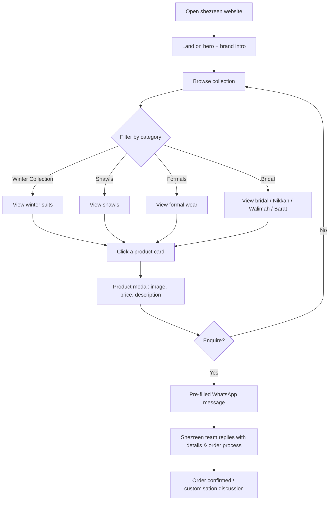

# Shezreen — Luxury Pret, Formals & Bridal

A single-page fashion boutique website for **Shezreen**, featuring a hand-curated product catalog, elegant editorial design, and WhatsApp-based ordering.


---

## What it's about

Shezreen is a luxury clothing brand. This website is its digital storefront:

- **Browse collections** — Winter Collection, Shawls, Formals and Bridal wear.
- **Enquire in one tap** — every product links straight to a pre-filled WhatsApp message, because pieces are made to order.
- **Elegant, editorial look** — serif typography, warm cream & gold palette, and full-bleed photography built to feel like a boutique, not a shop.

It is a fully static site (no backend required), designed to be deployed free on GitHub Pages or Vercel.

## Features

- Product catalog with categories and live filtering
- Product detail modal with images, price and description
- One-tap WhatsApp enquiry per product
- Responsive layout (mobile-first navigation, adaptive grids)
- Local image assets — no external image hosting, no broken links
- Smooth scroll, hover zooms, lightbox animations
- SEO-ready meta tags and custom favicon

## Tech Stack / Languages

| Layer     | Technology                                            |
| --------- | ----------------------------------------------------- |
| UI        | React 19 (JSX), CSS3                                   |
| Build     | Vite 8                                                 |
| Language  | JavaScript (ESM)                                       |
| Tooling   | oxlint (linting)                                       |
| Hosting   | GitHub Pages (workflow included) / Vercel              |
| Styling   | Custom CSS design system (variables, no frameworks)    |

## Workflow Diagram

How a visitor moves through the site from landing to order enquiry:



## Project Structure

```
Shezreen/
├── .github/workflows/deploy.yml   # GitHub Pages auto-deploy
└── client/                        # React + Vite frontend
    ├── public/
    │   ├── favicon.svg
    │   └── images/products/       # All product photography (local)
    └── src/
        ├── components/            # Navbar, Hero, Collection, Cards, Modal, Story, Contact, Footer
        ├── data/products.js       # Product catalog (edit this to update the shop)
        ├── config/site.js         # Brand name, contact, WhatsApp number
        ├── index.css              # Full design system
        └── App.jsx                # App shell
```

## Getting Started

```bash
cd client
npm install
npm run dev
```

Open `http://localhost:5173`.

## Build & Deploy

```bash
cd client
npm run build   # outputs to client/dist
npm run preview # preview the production build
```

Pushing to `main` triggers the GitHub Actions workflow which builds and deploys to GitHub Pages automatically.

## Customising the Catalog

Edit `client/src/data/products.js`:

- Add / remove / rename products, change prices and descriptions
- Drop new photos into `client/public/images/products/` and reference them by filename

Update brand details, WhatsApp number and socials in `client/src/config/site.js`.

---

© Shezreen. Handcrafted elegance in every thread.
